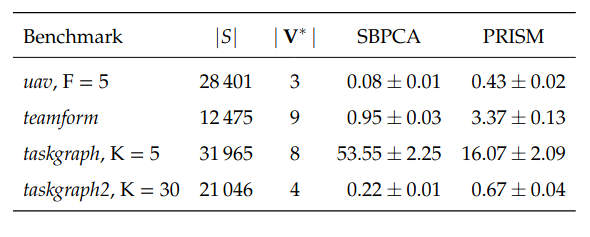

#	Simulation-based Pareto Curve Approximation
This repository implements a multi-objective extension of the BRTDP algorithm introduced by [McMahan et al.](https://www.cs.cmu.edu/~ggordon/mcmahan-likhachev-gordon.brtdp.pdf). The algorithm can solve multi-objective discounted-reward queries on general MDPs and reachability queries on SSPs (up to two objectives at once), relying on two components:

1. Convex Hull Value Iteration Updates, which iteratively refine lower and upper bounds on state-action Pareto curves
2. Partial exploration of the MDP via BRTDP-inspired heuristics, which prioritize less explored states, while retaining formal guarantees

This results in a simple yet powerful model checker that can solve certain benchmarks much more efficiently than standard methods, outperforming the state-of-the-art probabilistic model checker Prism on three of the four benchmarks considered. The table below lists the sizes of the state spaces of the MDPs, the true underlying Pareto front, and the verification time (in seconds) across 10 runs of PRISM and SBPCA. In each case, the result is an epsilon-approximation of the Pareto front, where eps = 0.01.

The accompanying text introducing the algorithm and a summary of the results can be found in Chapters 4 & 5 of my bachelor's thesis, available at https://is.muni.cz/th/as4mz/.

## Dependencies: c++17, cmake 3.12, Eigen 3.3 (sparse matrices), gnuplot (visualization)

## Installing the dependencies on Debian/Ubuntu can be done by running:
	 $ sudo apt-get install libeigen3-dev gnuplot cmake

## Afterwards, simply run:
	 $ mkdir build
	 $ cd build
	 $ cmake ..
	 $ make

## Running the benchmarks
After building, the final binary is located at build/mo-brtdp. 

The binary runs all the benchmarks 5 times for SCHVI, SBPCA-DB and SBPCA-PA,
outputting the results and statistics in out/.

The evaluation code is located in include/evaluation.hpp.

## Parser

The file format is described in depth here: [PRISM Format Description](https://www.prismmodelchecker.org/manual/Appendices/ExplicitModelFiles)
, see Transition ( .tra ) files and Transition Reward ( .trew ) files. 

It is also possible to specify multiple reward dimensions in a single file for any transition.

* Original PRISM format:
	+ 1 0 2 6 - transition from 1 under action 0 to state 2 has reward 6

* Additionally supported:
	+ 1 0 2 6 3 - transition has reward (6, 3)

More details on the parser ( all the things that are checked, etc. ) are given
in the source file src/parser.cpp

## Importing PRISM files

No CLI for now, but running the solvers on an MDP of your choice can be done as
follows.

Note that PRISM needs to be installed, see [github](https://github.com/prismmodelchecker/prism).

* Export the explicit transition files; this can be done using PRISM by
running the following in the root directory of PRISM

    $ prism/bin/prism MODEL_PATH --exporttrans out.tra --exporttransrewards out.trew

* Locate the ID of the starting state. This can be done by 
    $ prism/bin/prism MODEL_PATH --exportlabels labels.txt
		 , and looking at the index associated with the label "init", which is usually 0

* Run the solvers on these transition files. An example setup is given in include/eval_example.hpp
